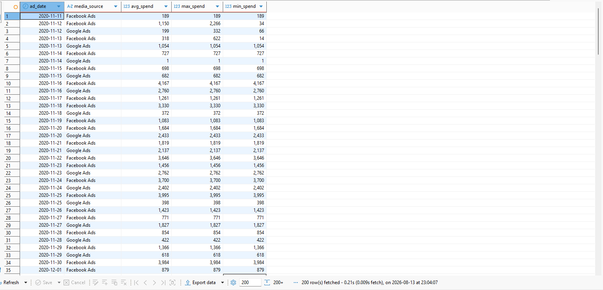
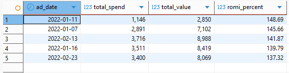
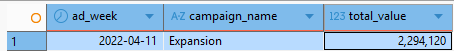
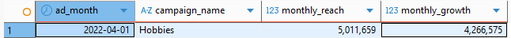
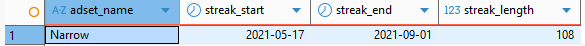

# SQL Online Campaign Analysis

## Project Overview

This project analyzes online advertising performance using SQL by combining Facebook Ads and Google Ads data.

The analysis focuses on campaign performance, return on marketing investment (ROMI), reach growth, and advertising trends using PostgreSQL.

---

## Business Objectives

- Analyze daily advertising spend metrics.
- Identify the highest ROMI days.
- Find the highest-performing campaign by weekly conversion value.
- Measure monthly reach growth.
- Detect the longest continuous impression streak.

---

## Dataset

The analysis uses the following tables:

- facebook_ads_basic_daily
- facebook_campaign
- facebook_adset
- google_ads_basic_daily

---

## SQL Skills Demonstrated

- Common Table Expressions (CTE)
- LEFT JOIN
- UNION ALL
- Aggregate Functions
- GROUP BY
- HAVING
- ORDER BY
- DATE_TRUNC
- Window Functions
- LAG()
- ROW_NUMBER()
- NULLIF
- ROMI Calculation

---

## Project Files

- daily_spend_metrics.sql
- top_romi_days.sql
- weekly_campaign_value.sql
- monthly_reach_growth.sql
- longest_impression_streak.sql

---

## Query Results

### 1. Daily Spend Metrics

---

### 2. Top 5 Days by ROMI

---

### 3. Highest Weekly Campaign Value

---

### 4. Monthly Reach Growth

---

### 5. Longest Continuous Impression Streak

---

## Technologies

- SQL
- PostgreSQL
- DBeaver

---

## Author

**Zeynep Tatlısöz**

Aspiring Data Analyst
